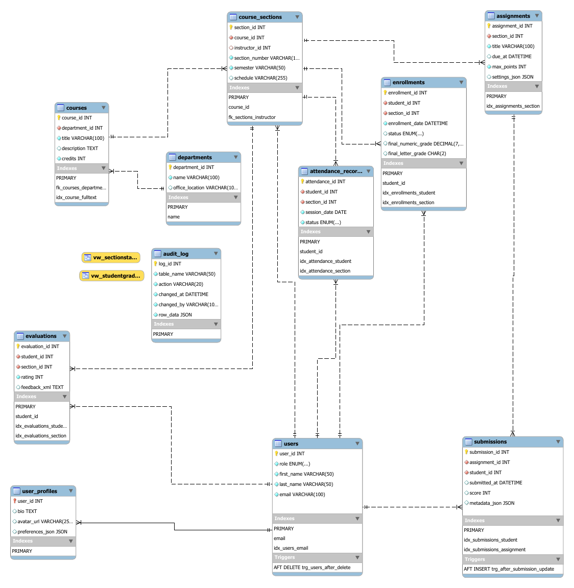
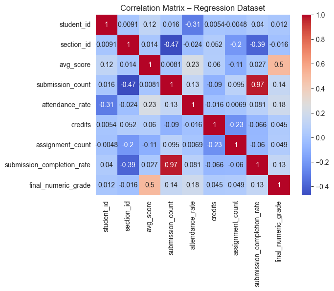
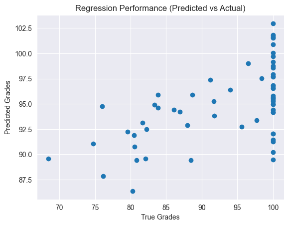
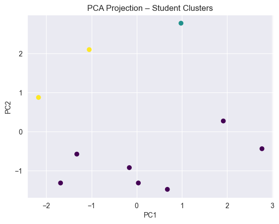

# Smart Learning & Course Analytics Platform

A MySQL database for a university learning platform, built to handle day-to-day academic work (enrollments, assignments, grading, attendance) and to feed analytics and machine-learning pipelines in Python.

**Tools:** MySQL 8.0 · SQL (window functions, CTEs, full-text search, JSON/XML) · Python (pandas, scikit-learn, SQLAlchemy, Faker) · MySQL Workbench

---

## Business problem

Academic systems often keep enrollments, grades, attendance and feedback in separate silos, so analytics end up slow and inconsistent. This project puts that data into **one normalized schema**. The same database can then run the platform and answer questions like *Which students are at risk? What drives final grades? What types of learners do we have?*

## What's inside

| Area | What was built |
|---|---|
| **Schema design** | 11 tables normalized to 3NF, with 1:1, 1:N and M:N relationships and one unified `users` table using role-based ENUMs |
| **Data integrity** | Foreign keys with `CASCADE`, `SET NULL` and `RESTRICT` chosen per relationship; `CHECK` constraints (credits > 0, rating 1–5); `UNIQUE` rules that prevent duplicate enrollments |
| **Semi-structured data** | JSON for user preferences, assignment settings and submission metadata (browser, IP, attempts); XML inside TEXT for course evaluation feedback |
| **Business logic** | 2 views, 2 stored procedures (`sp_RegisterStudent`, `sp_CalculateCourseGrade`) and 2 triggers (automatic grade recalculation and a JSON audit log on user deletion) |
| **Performance** | B-tree indexes on join and filter columns, plus a `FULLTEXT` index for course search |
| **Advanced queries** | `RANK`, `NTILE`, `LAG` and `LEAD` window functions, correlated subqueries, relevance-ranked full-text search, JSON and XML extraction |
| **Analytics datasets** | SQL extraction of three ML-ready datasets: regression (final grade), classification (dropout risk) and clustering (student segments) |
| **Python integration** | SQLAlchemy connection, EDA, linear regression, logistic regression and K-Means with PCA |

## Database design



## Sample data

There are ~3,850 synthetic records, generated with Python's **Faker** library, with all foreign keys kept valid. **None of this data describes real people.**

| Table | Rows | | Table | Rows |
|---|---|---|---|---|
| users | 30 | | enrollments | 250 |
| departments | 10 | | assignments | 130 |
| courses | 15 | | submissions | 1,115 |
| course_sections | 25 | | attendance_records | 2,000 |
| user_profiles | 30 | | evaluations | 250 |

## Example query: rank students within each section

```sql
SELECT
    e.section_id,
    u.user_id AS student_id,
    u.first_name,
    u.last_name,
    e.final_numeric_grade,
    RANK() OVER (PARTITION BY e.section_id
                 ORDER BY e.final_numeric_grade DESC) AS section_rank
FROM enrollments e
JOIN users u ON u.user_id = e.student_id
WHERE e.final_numeric_grade IS NOT NULL;
```

See [`sql/05_analytical_queries.sql`](sql/05_analytical_queries.sql) for the full set of queries.

## Analytics results

### Regression: predicting final grades

A linear regression on engagement features (average score, submissions, attendance rate, credits) reached **R² = 0.27**. **Average submission score** was the strongest predictor (r = 0.50 with the final grade).

| Correlation matrix | Predicted vs. actual |
|---|---|
|  |  |

### Classification: dropout risk

Every student in the synthetic data ended up in the "not at risk" class (no dropped enrollments and no final grades below 60). With only one class, a classifier can't be trained, so the notebook checks for this and stops cleanly. It shows how synthetic data can miss the patterns a model needs.

### Clustering: student segmentation

K-Means (k = 3) on standardized performance, attendance and satisfaction features, shown with PCA. The silhouette score was **0.10**, meaning the clusters are weak. That's expected with only 10 students in the sample data.



## Limitations and next steps

- **Synthetic data.** Model results show that the pipeline works end to end. They don't reflect real student behaviour.
- **Join fan-out.** Some extraction queries join `submissions` and `attendance_records` in the same `GROUP BY`, which multiplies rows and inflates counts (for example, a completion rate above 100%). The next step is to pre-aggregate each table in its own CTE before joining.
- **More data.** Generate a larger, more varied dataset, including dropouts and failing grades, so the classification and clustering tasks become meaningful.

## How to run

```bash
# 1. Build the database (MySQL 8.0+), running files in order
mysql -u root -p < sql/01_schema_and_indexes.sql
mysql -u root -p < sql/02_views_procedures_triggers.sql
mysql -u root -p < sql/03_sample_data.sql

# 2. Python analysis
pip install -r requirements.txt
export MYSQL_USER=root
export MYSQL_PASSWORD=your_password
jupyter notebook notebooks/smart_learning_analytics.ipynb
```

`04_dml_examples.sql` (UPDATE/DELETE demos), `05_analytical_queries.sql` and `06_ml_dataset_extraction.sql` can be run afterwards in any MySQL client.

## Repository structure

```
smart-learning-analytics-db/
├── README.md
├── requirements.txt
├── images/                              # ERD and charts
├── notebooks/
│   └── smart_learning_analytics.ipynb   # data generation + Python analytics
└── sql/
    ├── 01_schema_and_indexes.sql        # 11 tables, constraints, indexes
    ├── 02_views_procedures_triggers.sql # business logic
    ├── 03_sample_data.sql               # synthetic data (~3,850 rows)
    ├── 04_dml_examples.sql              # UPDATE / DELETE demos
    ├── 05_analytical_queries.sql        # window functions, full-text, JSON/XML
    └── 06_ml_dataset_extraction.sql     # regression / classification / clustering
```

## Team

Final group project for CPSC 500 SQL Databases, Master of Data Analytics, University of Niagara Falls Canada (2025).

**Lisandro Rios** · Rithik Roy Pakki · Mauricio Fernando Calderon Barrientos
